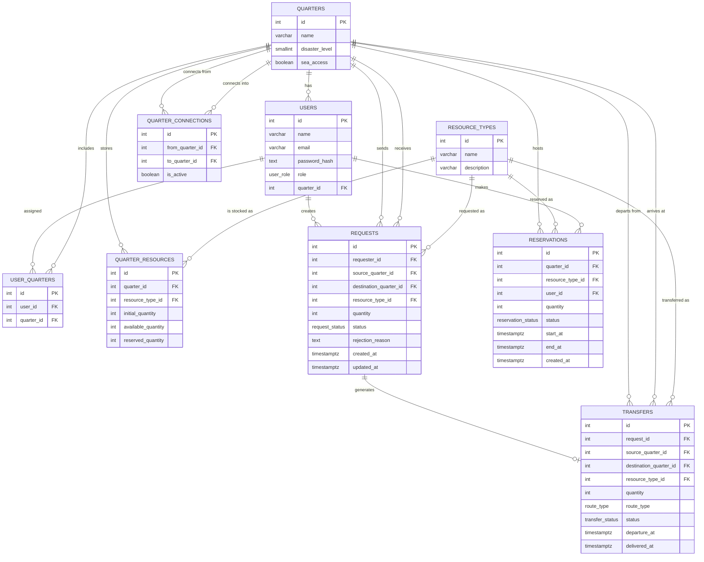

# KAIJU - Entity Relationship Diagram

```mermaid
erDiagram

    QUARTERS {
        int id PK
        varchar name
        smallint disaster_level
        boolean sea_access
    }

    USERS {
        int id PK
        varchar name
        varchar email
        text password_hash
        user_role role
        int quarter_id FK
    }

    USER_QUARTERS {
        int id PK
        int user_id FK
        int quarter_id FK
    }

    RESOURCE_TYPES {
        int id PK
        varchar name
        varchar description
    }

    QUARTER_RESOURCES {
        int id PK
        int quarter_id FK
        int resource_type_id FK
        int initial_quantity
        int available_quantity
        int reserved_quantity
    }

    QUARTER_CONNECTIONS {
        int id PK
        int from_quarter_id FK
        int to_quarter_id FK
        boolean is_active
    }

    REQUESTS {
        int id PK
        int requester_id FK
        int source_quarter_id FK
        int destination_quarter_id FK
        int resource_type_id FK
        int quantity
        request_status status
        text rejection_reason
        timestamptz created_at
        timestamptz updated_at
    }

    RESERVATIONS {
        int id PK
        int quarter_id FK
        int resource_type_id FK
        int user_id FK
        int quantity
        reservation_status status
        timestamptz start_at
        timestamptz end_at
        timestamptz created_at
    }

    TRANSFERS {
        int id PK
        int request_id FK
        int source_quarter_id FK
        int destination_quarter_id FK
        int resource_type_id FK
        int quantity
        route_type route_type
        transfer_status status
        timestamptz departure_at
        timestamptz delivered_at
    }

    QUARTERS ||--o{ USERS : "has"
    USERS ||--o{ USER_QUARTERS : "assigned"
    QUARTERS ||--o{ USER_QUARTERS : "includes"

    QUARTERS ||--o{ QUARTER_RESOURCES : "stores"
    RESOURCE_TYPES ||--o{ QUARTER_RESOURCES : "is stocked as"

    QUARTERS ||--o{ QUARTER_CONNECTIONS : "connects from"
    QUARTERS ||--o{ QUARTER_CONNECTIONS : "connects into"

    USERS ||--o{ REQUESTS : "creates"
    QUARTERS ||--o{ REQUESTS : "sends"
    QUARTERS ||--o{ REQUESTS : "receives"
    RESOURCE_TYPES ||--o{ REQUESTS : "requested as"

    QUARTERS ||--o{ RESERVATIONS : "hosts"
    RESOURCE_TYPES ||--o{ RESERVATIONS : "reserved as"
    USERS ||--o{ RESERVATIONS : "makes"

    REQUESTS ||--o| TRANSFERS : "generates"
    QUARTERS ||--o{ TRANSFERS : "departs from"
    QUARTERS ||--o{ TRANSFERS : "arrives at"
    RESOURCE_TYPES ||--o{ TRANSFERS : "transferred as"
```
